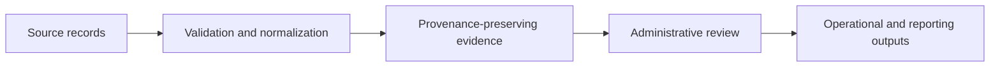

# AGRO-AI Public Engineering

[](https://github.com/Lamine-art-png/agro-ai-public-engineering/actions/workflows/security-checks.yml)

A deliberately sanitized engineering portfolio from **AGRO-AI Inc.**

This repository demonstrates how AGRO-AI approaches water-data reliability, evidence, administrative review, and reporting without publishing production source code, customer information, credentials, infrastructure topology, proprietary prompts, commercial logic, or confidential implementation details.

## Engineering focus

AGRO-AI builds systems that help organizations move from fragmented operational records to reviewable evidence and clear outputs:



## What is included

- Public architecture and delivery principles
- Security and governance boundaries
- Sanitized project patterns
- Fully synthetic water records
- A small non-production record-quality example
- Unit tests and automated publication-safety checks

## What is not included

This repository does **not** contain:

- AGRO-AI production applications or backend services
- Recommendation, optimization, or decision-engine logic
- Internal AI prompts, routing, model configuration, or evaluation data
- Customer-specific code, data, proposals, or deployments
- Cloud infrastructure, deployment manifests, or account identifiers
- Credentials, OAuth configuration, certificates, or production endpoints
- Proprietary connector implementations
- Internal runbooks, pricing logic, or commercial materials

## Repository map

- [`docs/architecture-overview.md`](docs/architecture-overview.md)
- [`docs/security-and-governance.md`](docs/security-and-governance.md)
- [`docs/selected-project-patterns.md`](docs/selected-project-patterns.md)
- [`docs/public-disclosure-boundary.md`](docs/public-disclosure-boundary.md)
- [`examples/synthetic-records`](examples/synthetic-records)
- [`examples/record-quality-checker`](examples/record-quality-checker)

## Run the synthetic example

```bash
python3 examples/record-quality-checker/check_records.py \
  examples/synthetic-records/input.csv
```

Run tests:

```bash
python3 -m unittest discover \
  -s examples/record-quality-checker \
  -p 'test_*.py'
```

## Controlled technical diligence

Qualified enterprise and public-agency customers may review selected architecture views, sanitized interface contracts, access boundaries, testing evidence, and implementation plans under an appropriate confidentiality arrangement.

Contact: **agroaicontact@gmail.com**

## Rights

Copyright © 2026 AGRO-AI Inc. All rights reserved. See [`NOTICE.md`](NOTICE.md).
